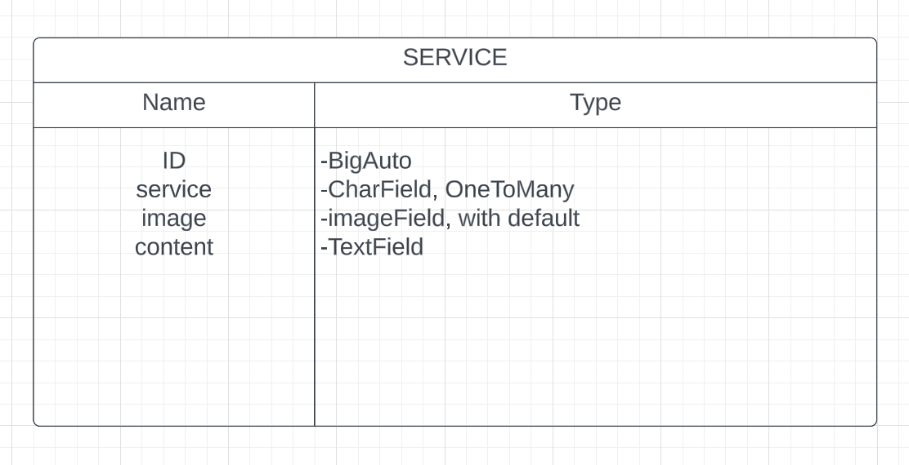

SIMPLY BOOKINGS - BACKEND API
==================================

* * *

ABOUT THE API:
------------------

* * * 

[DEPLOYED API HEROKU LINK]()

[DEPLOYED FRONTEND HEROKU LINK - LIVE SITE]()

[DEPLOYED BACKEND GITHUB REPOSITORY]()

_Simply Bookings_ is a Booking Software created in two separate projects using React, Django, Django Rest Framework.

The Front End project, consists on a stand alone React App. From within the React APP we make HTTP requests to the back-end Django REST Framework API. Instead of rendering the HTML template context object with JSON data responses. 

The Back End API was created using Django REST Framework. This back end, will return only JSON data.

This is the Back-End API project.

So what do we need from our API?

JSON data, which React uses to then render the UI.
CRUD functionality! Create, Retrieve, Update or Delete things like a profile, a class, a booking, etc. This is through the HTTP requests.
Receive responses such as 2xx OK, 4xx ERROR, 5xx SERVER ERROR.

* * *

## DJANGO REST FRAMEWORK

* * *

I decided to use Django REST Framework as I can easily make use of its serializers, APIVIew & generics, permissions and authentications. It can serve both mobile and web apps.

Login and Log out views of our API in-browser interface. These come with our REST Framework.

* * * 

# PROFILE APP:

* * *

What functionality to we want?
* List all profiles
* Option to view data in JSON 
* 

* * *

## MODEL:

We have made use of the standard Django user Model and referenced it in our models.

Profile Model Table:

USING DJANGO SIGNALS:
Every time a profile is created, a User is created. 

* * *

## VIEWS:

* * *

* ProfileList: 
    * get request listing all profiles.

* ProfileDetail
    * _get_object_: View handling request made for profile that doesn't exist and checks permissions.
    * _get method_: View profile details by fetching using pk. Calls the get_object method, calls profile serializer, and returns serializer data.
    * _put method_: Calls _get_object_ method by pk, calls serializer with profile and update data. If serializer vaid, save profile instance to database and return data in our response. If invalid, return Response with error.(400_BAD_REQUEST)

## SERIALIZERS:

* * *

Serializers Will handle validation of our data, and handle all the conversions between our data types. 

* Owner => ReadOnlyField
By default the owner field will always returm the users ID number.
For readibility, we override this by retrieving the users username instead.
* is_owner => can easily render profile-owner-specific UI elements (ex: edit and delete)

* Meta class model=Profile

* * *

## CUSTOM PERMISSIONS:

* * *

* Allow READ-ONLY access to every user
* Allow update and delete only to owner of resource.

* * *

# SERVICES APP:

* * *

What functionality to we want?
* List all services categories types available. For example: pilates, yoga, meditation, etc.
* Option to view data in JSON 
* Read only functionality for regular users. Full CRUD functinality for admin!

* * *

## MODEL:

Services Model Table:
ser

* * *

## VIEWS:

* * *

* get method: creates profile serializer instance, and response data returned from our serializer displaying Profile.objects.all()

## SERIALIZERS:

* * *

Serializers Will handle validation of our data, and handle all the conversions between our data types. 

* Owner => ReadOnlyField
By default the owner field will always returm the users ID number.
For readibility, we override this by retrieving the users username instead.
* is_owner => can easily render profile-owner-specific UI elements (ex: edit and delete)

* Meta class model=Profile

* * *

## CUSTOM PERMISSIONS:

* * *

* Allow READ-ONLY access to every user
* Allow update and delete only to owner of resource.

* * *

# TESTING:

* * *

* * *

# PEP8 testing:

* * *

 * * *

# TECHNOLOGIES USED:

* * *

### MAIN LANGUAGE:

* * *

PYTHON

* * *

### Frameworks, Libraries, Programs:

* * * 

* Django
* Django RestFramework
* Cloudinary
* Heroku
* Pillow
* Django Rest Auth
* PostgreSQL

* * *

## BUGS, ISSUES & FIXES:

* * *

* Initially intalled django 4.1
pip3 install 'django<4'

Django 3.2 is the LTS (Long Term Support) version of Django and is therefore preferable to use over the newest Django 4

