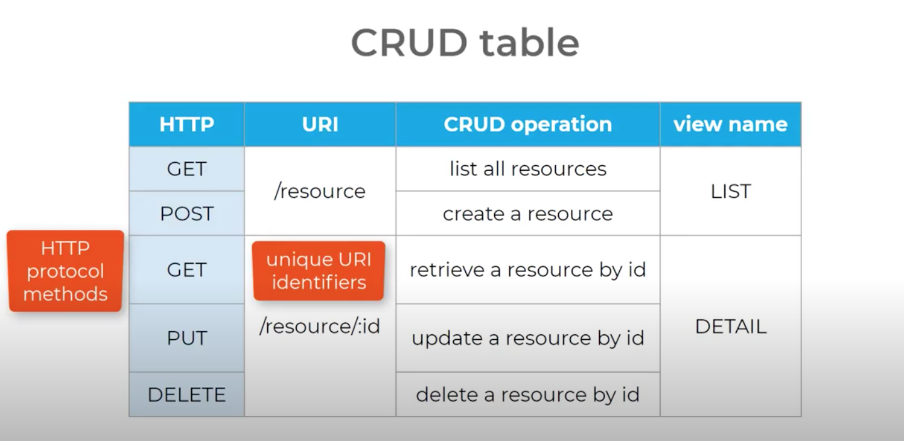
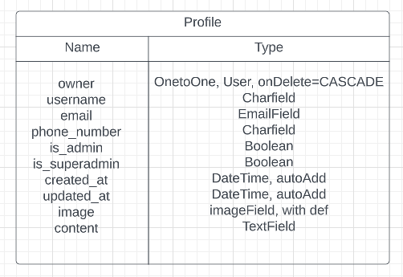

SIMPLY BOOKINGS - BACKEND API
==================================

* * *

ABOUT THE API:
------------------

* * * 

[DEPLOYED API HEROKU LINK]()

[DEPLOYED FRONTEND HEROKU LINK - LIVE SITE]()

[DEPLOYED BACKEND GITHUB REPOSITORY]()

_Simply Bookings_ is a Booking Software created in two separate projects using React, Django, Django Rest Framework.

The Front End project, consists on a stand alone React App. From within the React APP we make HTTP requests to the back-end Django REST Framework API. Instead of rendering the HTML template context object with JSON data responses. 

The Back End API was created using Django REST Framework. This back end, will return only JSON data.

This is the Back-End API project.

So what do we need from our API?

JSON data, which React uses to then render the UI.
CRUD functionality! Create, Retrieve, Update or Delete things like a profile, a class, a booking, etc. This is through the HTTP requests.
Receive responses such as 2xx OK, 4xx ERROR, 5xx SERVER ERROR.

* * *

## DJANGO REST FRAMEWORK

* * *

I decided to use Django REST Framework as I can eaisly make use of its serializers, APIVIew & generics, permissions and authentications. It cans erve both mobile and web apps.

* * * 

## DATABASE:

* * *
# PROFILE APP & MODELS:

We have made use of the standard Django user Model and referenced it in our models.

Profile Model Table:

USING DJANGO SIGNALS:
Every time a profile is created, a User is created. 

* * *

## VIEWS:

* * *
# PROFILE APP:

What functionality to we want?
* List all profiles
* Option to view data in JSON 

Profile Views:
* Profile List GET method: Returned all the listed profiles, serialized then, and then sent serialized data in the response.
* POST creation of profile: handles by signals.
* Profile Detail GET method: fetch profile by id, serialize Profile model instance and return serialized data in the response. HTTP 404 not found is handled when getting object.
* Profile Detail PUT method: fetch profile by id, call serializer woth profile and request data, if data is valid save and return instance, and if data is invalid return 400 ERROR

* DELETE : not implimented

* * *

## SERIALIZERS:

* * *

Will handle validation of our data, and handle all the conversions between our data types. 

# PROFILE SERIALIZER CLASS:

* Owner => ReadOnlyField
By default the owner field will always returm the users ID number.
For readibility, we override this by retrieving the users username instead.

owner= serializers.ReadOnlyField(
    source= 'owner.username
)

* Meta class model=Profile

* * *

## IN BROWSER LOGIN/LOGOUT:

* * *

* Made possible to log in and ot of our API in browser interface
* Written is_owner or ReadOnly custom permissions; so only profile owner can edit.

## TESTING:

* * *

* * *

## PEP8 testing:

* * *

 * * *

## TECHNOLOGIES USED:

* * *

### MAIN LANGUAGE:

* * *

PYTHON

* * *

### Frameworks, Libraries, Programs:

* * * 

* Django
* Django RestFramework
* Cloudinary
* Heroku
* Pillow
* Django Rest Auth
* PostgreSQL

* * *

## BUGS, ISSUES & FIXES:

* * *

